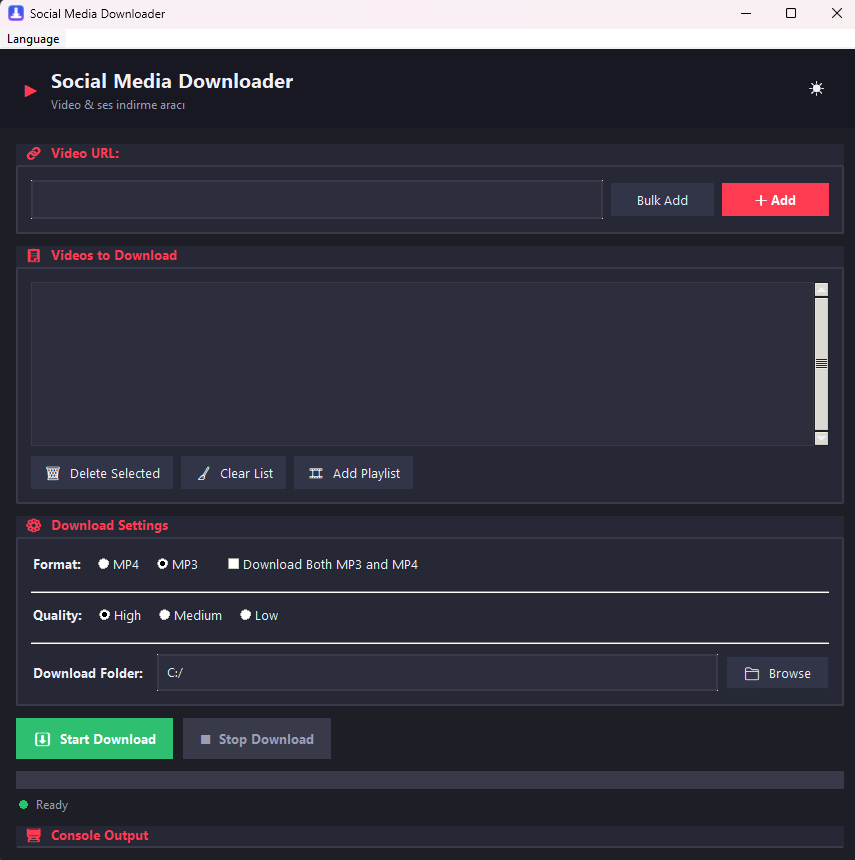

# Social Media Downloader

A modern, cross-platform GUI application for downloading videos and audio (MP4 / MP3) from a wide range of social media and video platforms. It is a visual front-end for the open-source **yt-dlp** tool.

---

## English

**Social Media Downloader** lets you download videos and audio in MP4 / MP3 format with a clean, modern interface. Supports bulk downloads, playlists, multiple qualities, theme switching (dark/light), and a multi-language UI.

**Supported platforms:** YouTube, TikTok, Instagram, Twitter/X, Facebook, Reddit, Twitch, Vimeo, Dailymotion and 1000+ more (via yt-dlp).



### Features
- 🎬 Download videos as MP4 or extract audio as MP3
- 📋 Bulk URL list and playlist import
- 🎚️ Quality selection (high / medium / low)
- 🎨 Dark & light themes
- 🌍 Multi-language interface
- ⚡ Single-file executable — no installation required
- 🔄 Automatic yt-dlp download & update

### Getting Started

To build the application from source:
1. Open PowerShell in the project root directory.
2. Run:
   ```powershell
   .\derle.ps1
   ```
   This will generate a single-file executable in the `dist/` folder.

To run the pre-built executable:
- Double-click `Social_Media_Downloader.exe` inside `dist/`, or download the latest build from the **Releases** page.

### Special Thanks ❤️

This project would not be possible without **yt-dlp** — the incredible open-source downloader that powers the whole thing.

- **Project:** https://github.com/yt-dlp/yt-dlp
- **Website:** https://yt-dlp.github.io/yt-dlp/

yt-dlp is released under the **Unlicense** (public domain). This project is licensed under the same license out of respect and gratitude for their contribution to the open-source community.

Developed by **Teknosenator** — Made in Turkey 🇹🇷
Contact: teknosenator@gmail.com · Website: https://hucrem.com · GitHub: https://github.com/hucremcom

---

## Türkçe

**Social Media Downloader**, çok sayıda sosyal medya ve video platformundan MP4 / MP3 formatında video ve ses indirmenizi sağlayan, modern arayüzlü bir uygulamadır. Açık kaynak **yt-dlp** aracının görsel bir arayüzüdür.

**Desteklenen platformlar:** YouTube, TikTok, Instagram, Twitter/X, Facebook, Reddit, Twitch, Vimeo, Dailymotion ve 1000+ daha fazlası (yt-dlp sayesinde).


### Özellikler
- 🎬 Videoları MP4 olarak indirin veya MP3 olarak ses çıkarın
- 📋 Toplu URL listesi ve playlist içe aktarma
- 🎚️ Kalite seçimi (yüksek / orta / düşük)
- 🎨 Koyu & açık tema
- 🌍 Çok dilli arayüz
- ⚡ Tek dosyalık çalıştırılabilir — kurulum gerektirmez
- 🔄 Otomatik yt-dlp indirme & güncelleme

### Başlarken

Kodu derleyerek çalıştırmak için:
1. Proje kök dizininde PowerShell açın.
2. Şu komutu çalıştırın:
   ```powershell
   .\derle.ps1
   ```
   Bu komut `dist/` klasöründe tek dosyalık bir çalıştırılabilir dosya oluşturur.

Hazır çalıştırılabilir dosyayı çalıştırmak için:
- `dist/` içindeki `Social_Media_Downloader.exe` dosyasına çift tıklayın veya **Releases** sayfasından en son sürümü indirin.

### Özel Teşekkürler ❤️

Bu proje, her şeyin arkasındaki inanılmaz açık kaynak indirici **yt-dlp** olmadan mümkün olamazdı.

- **Proje:** https://github.com/yt-dlp/yt-dlp
- **Web sitesi:** https://yt-dlp.github.io/yt-dlp/

yt-dlp **Unlicense** (kamu alanı) ile lisanslanmıştır. Bu proje de açık kaynak topluluğuna katkılarına saygı ve minnettarlık göstergesi olarak aynı lisansla lisanslanmıştır.

**Teknosenator** tarafından geliştirilmiştir — Türkiye'de yapıldı 🇹🇷
İletişim: teknosenator@gmail.com · Web: https://hucrem.com · GitHub: https://github.com/hucremcom

---

## License / Lisans

This project is licensed under the **Unlicense** (public domain) — the same license used by yt-dlp. See the [LICENSE](LICENSE) file for details.

Bu proje, yt-dlp ile aynı lisans olan **Unlicense** (kamu alanı) ile lisanslanmıştır. Ayrıntılar için [LICENSE](LICENSE) dosyasına bakın.
